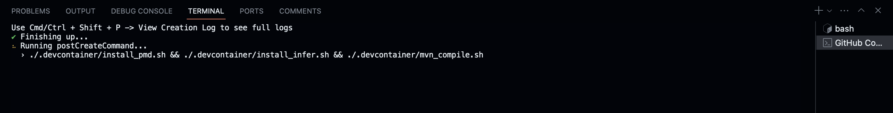

# 17 623 Quality Assurance: Recitation 2 Fall 2023

*Work in Progress*

---

## Installation

**GitHub Codespaces**

1. In the current repository, go to `<> Code > Codespaces > Create codespace on main`. 
2. Wait until the container finishes building.
3. After the Codespaces open, wait until receiving the message that the setup is Done and the terminal closes.



**Local Setup**

Follow the instructions presented in [Homework 4 - Static Analysis](https://canvas.cmu.edu/courses/36250/assignments/614274). This setup is not recommended for the purpose of the recitation (it may take sometime to setup).


## Content
```
.
├── README.md
├── projects/
    ├── infer/
    ├── pdm/
    └── spotbugs/
└── resources/              Presentation from the Recitation
```

# Exercises

### Exercise 1 (Infer): 

1. Open the classes `Student` and `App` and analyze what each one of them does.
2. In the terminal, change to the infer project directory (`projects/infer`).
3. Execute the following command in the terminal: `infer --bufferoverrun -- mvn clean package`
4. Analyze the output generated in the `infer-out` folder. Does it raise any error, and, if so, what program points are responsible?


### Exercise 2 (PMD): 

1. Open the class `CoffeeMachine` to understand its functionality.
2. 2. In the terminal, change to the pmd-tool project directory (`projects/pmd-tool`) and execute the command:

    ```pmd check --rulesets=ruleset.xml -d src/main/java --report-file pmd-report.txt```
3. Analyze the `pmd-report.txt` report file generated. Which of the rules in `ruleset.xml` were triggered and why? 
4. Add three new rules to the `ruleset.xml` that analyzes the code and detects an error. The [Index for Java Rules can be found here](https://docs.pmd-code.org/latest/pmd_rules_java.html). Each rule should detect one of the following properties:
    - **Best Practices:** `switch` statements should always contain a `default` case, allowing it to process undefined cases.
    -  **Code Style:** Variable names should be descriptive of the information type they contain. For example, `hasWater` is an `int` value, but the prefix assumes the variable is a `boolean`.
    - **Error Prone:** Values in `if` conditions should not be hardcoded, as changes to a value may require manual change into multiple lines, which is prone to errors. 
    For example, changing the amount of water when calling `buyCappuccino` requires changes to line `87` and `95`.


### Exercise 3 (SpotBugs):

1. The `spotbugs` folder containsa  project that allows you to visualize the participants and spectators of a Volleyball game, as well as, any incoming games between players.
2. In the terminal, change to the spotbugs project directory (`projects/spotbugs`) and execute the command:

```mvn site```
3. Analyze the `.html` report present in `target/site/summary.html`.

